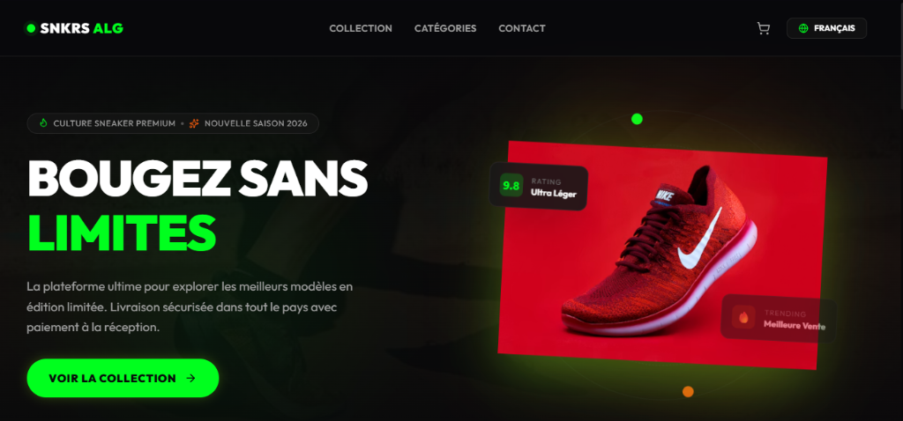

<div align="center">
  

  # 👟 Premium Sneaker Storefront

  **A modern, blazing-fast, and bilingual (French & Arabic) e-commerce platform built for limited-edition sneakers and streetwear.**
  
  ### 🌐 [Live Demo: shoes-website-phi-two.vercel.app](https://shoes-website-phi-two.vercel.app)
  
  [](https://nextjs.org/)
  [](https://react.dev/)
  [](https://tailwindcss.com/)
  [](https://supabase.com/)

</div>

---

## 🌟 About The Project

This project is a fully-featured, high-performance E-commerce storefront tailored specifically for sneakerheads. Designed with a dark "obsidian and neon" aesthetic, it delivers a premium, immersive shopping experience. The application provides seamless language switching between French and Arabic (with full RTL support).


## ✨ Key Features

- **🛍️ Dynamic Sneaker Gallery**: Advanced filtering by category, "Hot Drops", and "New Arrivals".
- **🌍 Bilingual & RTL Ready**: Seamless real-time switching between French (LTR) and Arabic (RTL).
- **🛒 Seamless Checkout**: Frictionless cart management designed for quick conversions.
- **🛡️ Secure Admin Dashboard**: Full inventory and order management system built for store owners.
- **⚡ Blazing Fast**: Built on Next.js App Router with optimized image loading and server-side rendering.
- **🎨 Modern UI/UX**: Dark mode by default, featuring glassmorphism, micro-animations, and custom neon accents.
- **🗄️ Supabase Integration**: Real-time database syncing, authentication, and secure data storage.

## 🛠️ Technology Stack

- **Framework**: Next.js 16 (App Router)
- **Library**: React 19
- **Styling**: Tailwind CSS v4
- **Database / Auth**: Supabase SSR
- **Icons**: Lucide React
- **Language**: TypeScript

## 🚀 Getting Started

To run this project locally:

### 1. Clone the repository
```bash
git clone https://github.com/yourusername/shoes-website.git
cd shoes-website
```

### 2. Install dependencies
```bash
npm install
```

### 3. Set up Environment Variables
Create a `.env.local` file in the root directory and add your Supabase credentials:
```env
NEXT_PUBLIC_SUPABASE_URL=your_supabase_url
NEXT_PUBLIC_SUPABASE_ANON_KEY=your_supabase_anon_key
```

### 4. Run the development server
```bash
npm run dev
```

Open [http://localhost:3000](http://localhost:3000) with your browser to see the result.

## 🤝 Contributing

Contributions, issues, and feature requests are welcome! Feel free to check the issues page.

## 📜 License

This project is open-source and available under the [MIT License](LICENSE).
